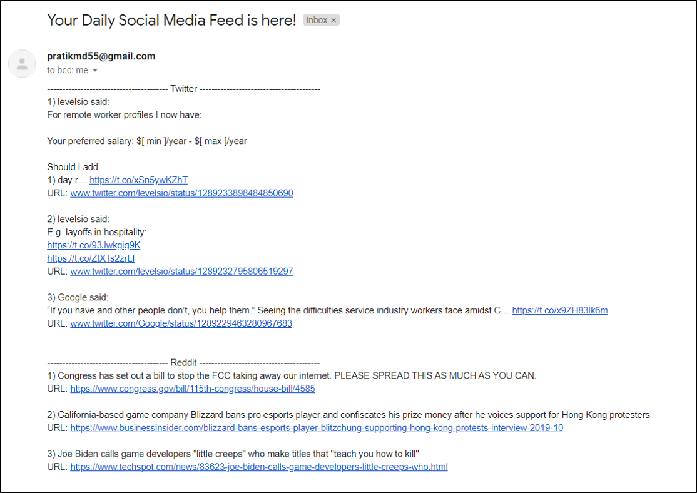

# Social Media Email Service

Social Media Feed Email Service is a web script application created in Python. 

In simple terms, it gathers the top 10 feed blogs from Reddit as well as top 10 timeline tweets from Twitter, pre-processes them into a more neat format, and emails them to a receiver (in this case myself).

The motivation behind this project was to save me some time going through Reddit and Twitter in the morning to see the top feeds. Just like we get newsletters, I get this social media feed letter which makes it an amazing project to make if you are just starting out with Reddit and Twitter APIs.

## Prerequisite
- Python version 3.x
- Praw library
- Tweepy library

# Implementation Instructions
- Create an app in Reddit apps website.
- Create an app in Twitter apps website.
- Clone the repository
- Create a ‘config.json’ file in root directory with the following structure,
```
{
  "reddit": 
    {
  	"client_id": "your app’s client id",
  	"client_secret": "your app’s client secret",
        "username": "your Reddit account username",
  	"password": "your Reddit account password"
    },
  "twitter": 
    {
        "api_key": "your api key",
        "api_secret_key": "your api secret key",
        "access_token": "your access token",
        "access_token_secret": "your access token secret"
    }
}
```

<b>Note:</b> In this project you will be using your own Reddit account’s feed. To perform account-specific tasks we need authenticated access and thus we have also included username and password fields this time.

- We will use python’s inbuilt libraries smtplib and SSL for this. smtplib is an SMTP (Simple Mail Transport Protocol) service used to send any email communications. SSL (Secure Socket Layer) is a protocol used for encrypting an SMTP connection.

    <b>Note:</b> It's not safe to have your password hardcoded in your code. Also, it's not a good practice to just input the password using the method ‘input()’ since it will be visible. Thus we used the ‘getpass()’ function. It hides your input which serves our purpose perfectly.

- In the main.py file, edit send_email function. Insert your email address in 'sender_email' variable and email where you want to receive feed in 'receiver_email'.
- Run the main.py file using Terminal. If you run the code using IDE, it may not accept the password input with getpass().
If you want to run the code in IDE, replace line 95 with basic 'input()' function. 

## Screenshots

